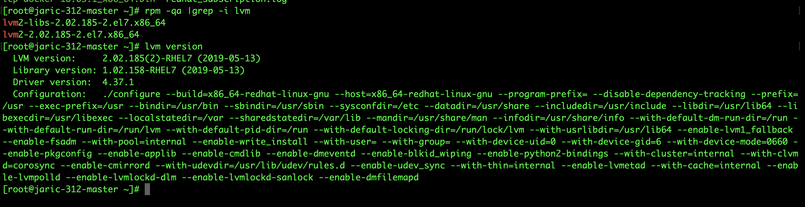
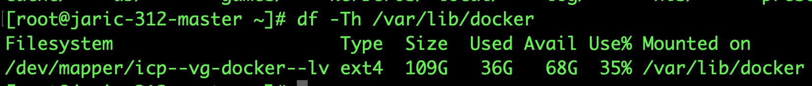
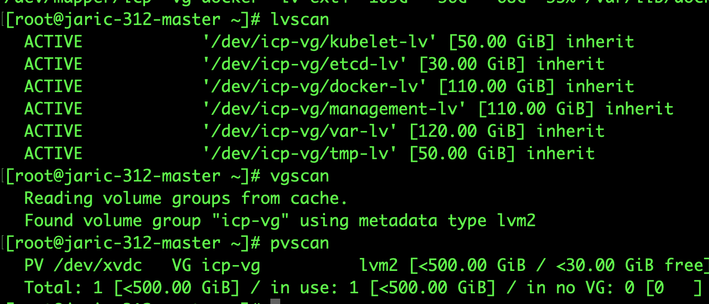

# how-to-create-logical-volume

This repo illustrate how to create logical volume and mount it into linux operating system

# Before you begin

Install the package in order to run the command in [script example](scripts/example.sh)

```s
#  Verify LVM is installed or not on the server.
rpm -qa |grep -i lvm


# Install the lvm2 package
yum install lvm2*

# Check the LVM version.
lvm version
```



Navigate to [script example](scripts/example.sh) to know how to execute the command.

# How to verfiy?

1.

`df -Th <the directory you create>`
The output should return you the example name as : /dev/mapper/icp--<logical volume you create just now>--lv


2.

```bash
# Display Information about PVs ,LVs, VGs.
pvdisplay
vgdisplay
lvdisplay

# Commands to Scan PVs, LVs and VGs

pvscan
vgscan
lvscan
# Note: All these commands, work properly on Redhat/Centos/Ubuntu systems
```



### Note : example source code take from [ibm-cloud-private-terraform-softlayer](https://github.com/pjgunadi/ibm-cloud-private-terraform-softlayer/blob/master/scripts/createfs_master.sh.tpl)

### You may find out how to provision IBM Cloud Private using terraform at there

# Another Example

```
Create local directories as follows on each IBM Cloud Private worker node, and record the IP address of each worker node where the directories are created. You will need these values in the next step.
/k8s/data/cassandra - Cassandra persistent storage
mkdir -p /k8s/data/cassandraCopy
/k8s/data/zookeeper - Zookeeper persistent storage
mkdir -p /k8s/data/zookeeperCopy
/k8s/data/kafka - Kafka persistent storage
mkdir -p /k8s/data/kafkaCopy
/k8s/data/couchdb - CouchDB persistent storage
mkdir -p /k8s/data/couchdbCopy
/k8s/data/datalayer - Datastore persistent storage
mkdir -p /k8s/data/datalayer
```

Please see the complete version of [example 1](scripts/example1.sh) to know how to mount the require disk above
